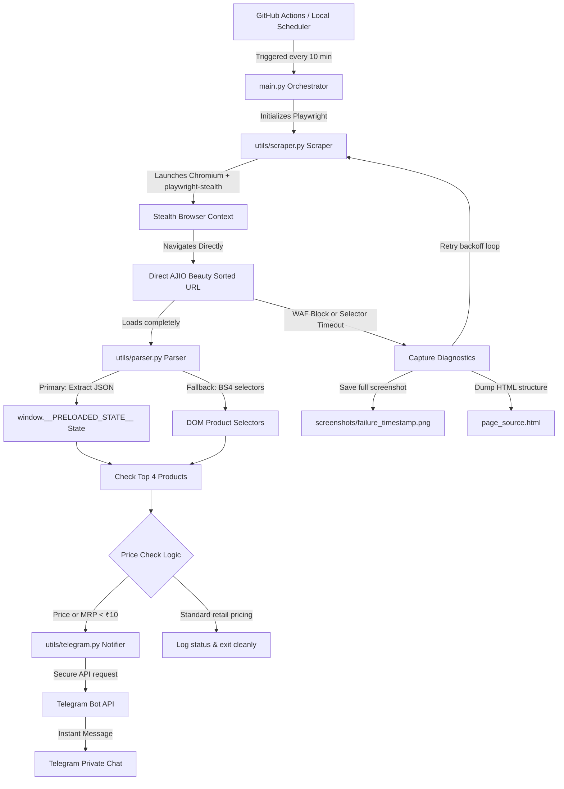

# AJIO Price Monitor Bot 🚨🛍️

A modular, production-ready Python bot designed to monitor the first 4 products from the AJIO beauty category page sorted by low-to-high price. The bot automatically sends instant Telegram alerts whenever any of these top products hits a current price or MRP **less than ₹10**.

Running 24/7 on the **GitHub Actions free tier**, the scraper utilizes a highly optimized **Playwright Chromium browser** with **playwright-stealth** to safely bypass Akamai WAF protections and extract price cuts.

---

## 🏗️ Architecture & Core Design

Below is the execution pipeline showing how GitHub Actions orchestrates the browser and delivers alerts:



### Why standard requests-only scraping fails on AJIO:
*   **Akamai Bot Management**: AJIO protects its endpoints using Akamai WAF, which analyzes inbound HTTP connection handshakes. Standard scraping libraries like Python `requests` or `urllib3` do not perform real browser SSL negotiation, JA3 fingerprinting, or handle standard HTTP/2 context headers. They are immediately greeted with a **403 Forbidden Access Denied** block page.
*   **Dynamic JS Rendering**: AJIO uses client-side React hydration. Raw HTTP pages lack a JavaScript engine, meaning listing items are not rendered in the standard HTML body and cannot be parsed by BeautifulSoup-only scraping.

### Why Playwright is used:
*   **Real V8 JavaScript Engine**: Playwright drives a real Chromium process, executing all client-side React state initializations and fetching category data naturally.
*   **Evasion via playwright-stealth**: Bypasses browser identification heuristics like `navigator.webdriver` flags, standard Chrome permissions, and default system plugins, rendering the bot indistinguishable from a legitimate user.
*   **Built-in Failure Diagnostics**: If a page fail triggers, Playwright allows us to capture rich, full-page screenshots into `/screenshots/` and dump live DOM states into `page_source.html` for offline debugging.

---

## 📂 Repository Structure

The project has a highly modular organization:

```
ajio-price-monitor/
├── .github/
│   └── workflows/
│       └── monitor.yml         # GHA scheduling workflow (runs every 10 min, cached pip & browsers)
├── utils/
│   ├── logger.py               # Streamlined logger supporting verbose DEBUG levels
│   ├── telegram.py             # Secure Telegram Bot API message dispatcher
│   ├── scraper.py              # Playwright sync manager, stealth runner, and diagnostic exporter
│   └── parser.py               # Core data parser (React state regex and BeautifulSoup fallbacks)
├── screenshots/                # Diagnostic folder for browser failure screenshots (Git-ignored)
├── .gitignore                  # Excludes virtual environments, secrets (.env), & debug files
├── requirements.txt            # Python execution dependencies (playwright, beautifulsoup4, dotenv)
├── playwright.config.py        # Centralized configurations for browser viewports and locales
├── sample.env                  # Template configuration credentials file for local developers
├── main.py                     # Orchestrator coordinating browser navigations, parsing, & alerts
└── README.md                   # Professional comprehensive documentation (this file)
```

---

## 🚀 Setup & Installation Instructions

### 1. Telegram Bot Creation
1. Start a chat on Telegram with [@BotFather](https://t.me/BotFather).
2. Use the command `/newbot` and follow the instructions to set up your bot name and get your **TELEGRAM_BOT_TOKEN**.
3. Search for [@userinfobot](https://t.me/userinfobot) and start a chat to instantly fetch your numeric **TELEGRAM_CHAT_ID** (e.g., `1458838187`).
4. **CRITICAL**: Start a chat directly with your newly created bot so it has permission to message you.

---

### 2. Local Setup & Execution Guide
Ensure you have Python 3.11+ configured.

1. **Clone the repository**:
   ```bash
   git clone <your-repository-url>
   cd ajio-price-monitor
   ```

2. **Initialize a Virtual Environment**:
   ```bash
   python3 -m venv .venv
   source .venv/bin/activate  # On Windows: .venv\Scripts\activate
   ```

3. **Install Dependencies**:
   ```bash
   pip install --upgrade pip
   pip install -r requirements.txt
   ```

4. **Install Playwright Chromium Browser**:
   ```bash
   playwright install chromium
   ```

5. **Setup Local Credentials**:
   Copy the sample environment file:
   ```bash
   cp sample.env .env
   ```
   Open `.env` in a text editor and enter your credentials:
   ```env
   TELEGRAM_BOT_TOKEN=8703119109:AAEpKyH52ERac3bmXTI9W6c8weV9Y_u0WrU
   TELEGRAM_CHAT_ID=1458838187
   DEBUG=true
   ```
   
   > [!TIP]
   > **Headed Debugging Mode (Requirement 17 & 18)**:
   > - Setting `DEBUG=true` launches Chromium in **headed mode** (visible browser window) so you can physically watch Playwright navigate, apply stealth plugins, and parse listing items.
   > - It also triggers a **test Telegram alert** upon successful completion so you can immediately verify that your Telegram chat credentials are 100% correct.

6. **Run the program locally**:
   ```bash
   python main.py
   ```

---

### 3. GitHub Actions Deployment & Secrets Configuration

To run the bot 24/7 on GitHub's cloud environment, configure repository secrets.

#### Step-by-Step GitHub Secrets Settings:
1. Navigate to your repository page on GitHub.
2. Click **Settings** (gear icon) → **Secrets and variables** → **Actions**.
3. Click the green **New repository secret** button.
4. Add the following secrets:

| Secret Name | Required Value | Explanation |
|:---|:---|:---|
| `TELEGRAM_BOT_TOKEN` | `8703119109:AAEpKyH52ERac3bmXTI9W6c8weV9Y_u0WrU` | Authorized API Token for your Telegram Bot |
| `TELEGRAM_CHAT_ID` | `1458838187` | User profile private chat recipient ID |

The workflow `.github/workflows/monitor.yml` will securely map these secrets to environment variables at runtime.

#### Manual Triggering:
1. Navigate to the **Actions** tab on your GitHub repository.
2. Under the list on the left side, click **AJIO Price Monitor**.
3. Click the **Run workflow** dropdown on the right and select your branch (e.g., `main`).
4. Click **Run workflow** to initiate an immediate scraping run!

---

## 🌐 Using ScraperAPI Residential Proxies

### Why GitHub Actions was blocked:
AJIO employs Akamai Web Application Firewall (WAF), which actively blocks public cloud datacenter IP ranges (such as Microsoft Azure/AWS IP pools where GitHub Action runners execute). When scraper requests originate from these datacenters, the platform issues an immediate `403 Forbidden` block page.

### Why the previous Proxy approach failed:
Attempting to connect ScraperAPI as a native Chromium proxy (`http://proxy-server.scraperapi.com:8001`) causes the browser to hang indefinitely on a blank window (`about:blank`). This happens because Chromium's proxy authentication protocol introduces complex gateway handshakes and SSL interception overheads, resulting in connection timeouts before the page can resolve. ScraperAPI is optimized for direct fetch/rendering endpoint routing rather than browser-level tunnel proxying.

### How the Fetch Endpoint solves WAF issues (Correct Architecture):
Instead of routing Chromium's engine traffic through a proxy tunnel, the scraper launches standard Playwright Chromium locally and directs it to ScraperAPI's secure, pre-rendered fetch endpoint:
```
GitHub Actions / Local Runner
          ↓ (Launches Standard Playwright Chromium)
Playwright Chromium
          ↓ (Loads rendered URL with key)
ScraperAPI Fetch Endpoint (render=true)
          ↓ (Fetches category via residential proxy network)
AJIO Category Page
          ↓ (Returns rendered HTML payload)
Telegram Alert Dispatcher
```
By appending `render=true` to the ScraperAPI URL, the proxy platform handles all heavy JavaScript execution and dynamically fetches category listings using clean domestic internet service provider (ISP) residential IPs, returning the fully hydrated HTML seamlessly to our browser.

### How to add SCRAPERAPI_KEY secret on GitHub:
1. Navigate to your repository page on GitHub.
2. Click **Settings** (gear icon) → **Secrets and variables** → **Actions**.
3. Click the green **New repository secret** button.
4. Add the following secret:
   * **Name**: `SCRAPERAPI_KEY`
   * **Value**: *Your ScraperAPI Key* (e.g. `dbc101a1357311aed28acbd026d49314`)
5. Click **Add secret** to encrypt and save. The scheduler will map the secret to the environment automatically on every run.

### Local Setup Instructions:
1. Add your ScraperAPI key inside your local `.env` file:
   ```env
   SCRAPERAPI_KEY=dbc101a1357311aed28acbd026d49314
   ```
2. Run the scraper locally:
   ```bash
   python main.py
   ```
3. The scraper will output logs showing `Using ScraperAPI rendered fetch endpoint...` followed by `ScraperAPI URL generated successfully` and `Launching Chromium without proxy mode`.

### Troubleshooting:
*   **Missing Key**: If the key is missing from the environment, the scraper logs a critical exit warning and terminates execution immediately to avoid launching unproxied requests which would get blocked by the WAF.
*   **Latency**: Rendering residential proxy requests introduces high latency. Playwright's timeout inside `playwright.config.py` is configured to `90000ms` (90 seconds) to ensure plenty of time for ScraperAPI to render and return the page successfully.

---

## 🔍 Debugging & Screenshot Diagnostics

If a run fails due to selector changes, dynamic rendering waits, or WAF blocks:
*   The script **never crashes completely** (Requirement 7). It catches exceptions and runs diagnostic exports before exiting safely.
*   It captures full-screen PNGs into the `/screenshots` directory (e.g. `failure_20260521_123000.png`) to help you visualize what Playwright loaded.
*   It dumps the active page DOM into `page_source.html` for offline structure inspection.
*   On GitHub Actions, if a run fails, the pipeline automatically archives these screenshots as a build artifact, which you can download from the Action Run page under **Artifacts → diagnostic-screenshots**.

---

## ⚠️ Limitations & Notes

*   **Cloud Run Rate-Limits**: E-commerce platforms sometimes restrict access to common public cloud IPs (like Microsoft Azure IP pools used by GitHub Actions). The bot's stealth context and retry mechanism mitigate this, but transient `403` blocks can occur.
*   **GHA Schedule Jitter**: GitHub Action schedules are queued on a best-effort basis. The `*/10 * * * *` cron generally fires close to every 10 minutes, but minor queuing delays can happen depending on GitHub's active queue traffic.
*   **DOM Structure Shifts**: If AJIO alters its CSS classes, our BeautifulSoup selectors fallback may fail. However, since the primary React hydration parser extracts listings directly from `window.__PRELOADED_STATE__`, the system is highly resilient to visual layout updates.
